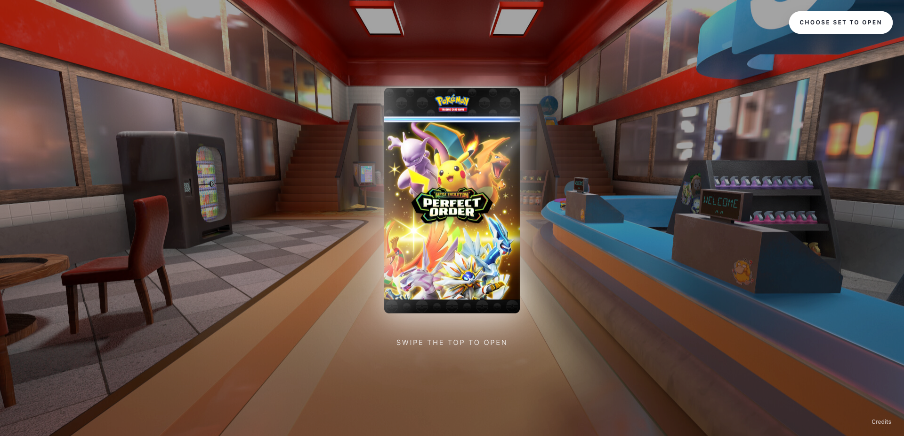
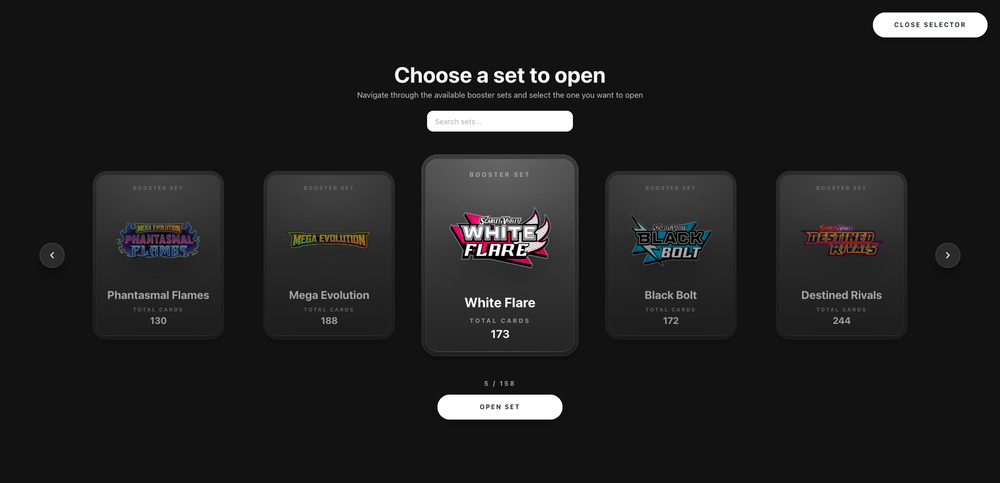
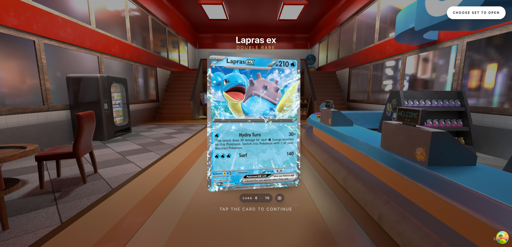

# Pokémon Booster Pack Simulator

<table border="0">
  <tr>
    <td></td>
    <td></td>
  </tr>
  <tr>
    <td></td>
    <td></td>
  </tr>
</table>

A browser-based simulator for opening Pokémon TCG booster packs. Browse any set from the Pokémon TCG API, open a pack with a swipe gesture, and flip through your cards one by one — with parallax tilt and a full-screen inspector on click.

## Features

- Animated idle pack with a swipe-to-open gesture
- Set selector with search and paginated carousel across 150+ sets
- Card-by-card reveal with flip animations
- Parallax tilt effect on each card
- Full-screen card inspector with spotlight effect
- Card rarity labels pulled from live API data

## Tech

- [React 19](https://react.dev/) + [TypeScript](https://www.typescriptlang.org/)
- [Vite](https://vitejs.dev/)
- [Chakra UI v3](https://chakra-ui.com/) + [Emotion](https://emotion.sh/)
- [Framer Motion](https://www.framer.com/motion/)
- [TanStack Query](https://tanstack.com/query)
- [react-parallax-tilt](https://github.com/mkosir/react-parallax-tilt)
- [react-slick](https://react-slick.neostack.com/)
- [Pokémon TCG API](https://pokemontcg.io/)
